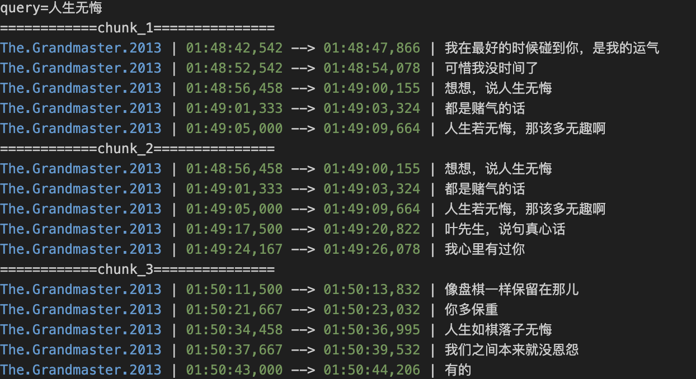

# subtitle-search
根据语义相似度搜索电影台词

## 项目背景
当时想找电影某句台词的上下文，看了现有几个网站（如：找台词等），虽然可以实现功能，但都是关键字匹配，所以才有了这个项目


## 运行
项目运行分为两步：
1. 将电影字幕向量化，本项目使用的是`bge-m3`，需要手动下载到`model`目录下。
    ```
    sh run_vectorization.sh
    ```
2. 根据某一句话搜索台词，`query`参数为要搜索的查询。
    ```shell
    sh search_subtitle.sh
    ```
    示例：
    * 输入：“人生无悔”
    * 输出：如下图所示，输出了3个相关片段，每个片段的上下文窗口大小为`5`，输出格式为：“电影名称\t时间片\t台词”。
    
    


## 项目结构

* `conf/`：项目配置文件
* `data/subtitles`：字幕数据，支持单个文件或者文件夹
* `model/`：向量化模型文件位置
* `sbin/`：运行脚本
* `src/`：项目源码文件


## 说明
* 目前结搜索果展示上下5句台词
* 仅支持srt格式的字幕
* 字幕文件编码格式为`utf-8`
